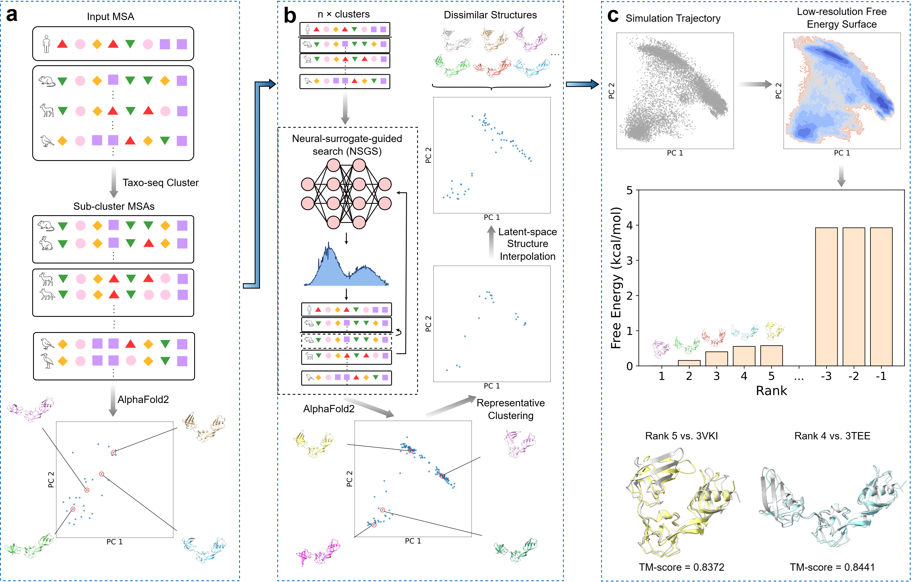

# ProCEDiS

ProCEDiS (Protein Conformation Ensemble of Dissimilar Structures) is a research framework for generating a compact ensemble of representative protein conformations **without prior state annotations**. It explores MSA recombination guided by a neural surrogate, models candidate structures with AlphaFold2-derived predictors, and optionally runs parallel short-timescale molecular dynamics (MD) simulations on selected structure seeds to obtain a quick (crude) free-energy estimate and identify physically plausible representative states.



## Repository layout
- `01_1_msa_cluster.py`, `01_2_fold_cluster_results.py`  
  MSA clustering and folding/aggregation utilities.
- `02_1_conformation_search.py`, `02_2_fold_search_results.py`, `02_3_collect_structure_pool.py`  
  Conformation search, folding of candidates, and structure pool collection.
- `03_1_seed_selected_for_md.py`, `03_2_system_build.py`, `03_3_md_simulation.py`, `03_4_extract_protein_traj.py`  
  Seed selection for MD, system setup, MD runs, and trajectory extraction.
- `utils/`, `model/`, `openfold_tools/`  
  Utilities, learning components, and OpenFold/AF2-related wrappers.

## Installation (minimal)
ProCEDiS relies on OpenFold (included as a git submodule). First, clone this repository with submodules and follow the **OpenFold repository instructions** to install OpenFold. After OpenFold is working, install the additional dependencies used by ProCEDiS:

```bash
git clone --recurse-submodules https://github.com/zhybio/ProCEDiS.git
cd ProCEDiS
# If you already cloned without submodules:
# git submodule update --init --recursive

conda install -c conda-forge scikit-learn mdtraj
pip install ray
```

## Quick start
A typical workflow is:

1. Prepare inputs under `inputs/`
2. Run MSA clustering:

```bash
python 01_1_msa_cluster.py
```

3. Fold/aggregate cluster results:

```bash
python 01_2_fold_cluster_results.py --gpus="0"
```

4. Conformation search and folding:

```bash
python 02_1_conformation_search.py --gpus="0" --players_per_gpu="2"
python 02_2_fold_search_results.py --gpus="0"
python 02_3_collect_structure_pool.py
```

5. MD crude free-energy estimation:

```bash
python 03_1_seed_selected_for_md.py --gpus="0"
python 03_2_system_build.py
python 03_3_md_simulation.py --gpus="0,1"
python 03_4_extract_protein_traj.py
```

6. Rank and extract representative energy basins (optional)  
To identify diverse low-energy basins and pick representative structures, see the notebook:
- `notebook/basin_rank.ipynb`

This notebook uses `find_diverse_basins(...)` to iteratively locate multiple low-energy basins on the 2D energy surface and select representative frames. You can adjust:

- `n_basins`: number of distinct basins to extract
- `mask_radius`: radius (in bins) masked around each selected basin to enforce diversity
- `n_per_basin`: number of low-energy bins/frames to keep per basin

After selecting basins/frames, you can export representative structures for downstream inspection and visualization.

## Citation
If you use ProCEDiS in academic work, please cite the accompanying paper (to be added). 
You may also need to cite upstream OpenFold/AlphaFold2 and relevant dependencies as appropriate.

## License
- ProCEDiS code: MIT License (see LICENSE)
- OpenFold submodule: Apache-2.0 (see the submodule repository for details)
